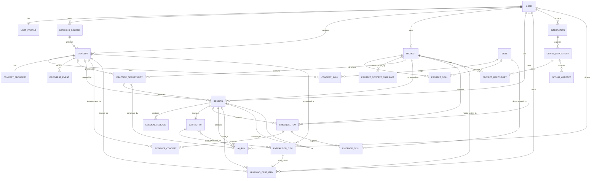

# AppliedLoop — Data Model

> **Status:** authoritative schema reference, taken from the source spec's data-model section (2026-10-05).
> Anything tagged **[proposed]** comes from [SPEC_REVIEW.md](SPEC_REVIEW.md) and was **approved by the product owner on 2026-10-05** (see the SPEC_REVIEW resolution log) and is now authoritative. Everything else is the source spec's, unchanged.

## Rules

- PostgreSQL. UUID primary keys. UTC timestamps (`timestamptz`).
- Every user-owned query must enforce `user_id` ownership. Never accept a client-supplied `user_id` as authorization.
- Foreign keys everywhere. Cascade behavior must be intentional (see [Cascade policy](#cascade-policy-proposed)).
- Migration files are checked into source control.
- Multi-record state changes run in a single transaction.
- Model-written and user-written facts live in separate columns (`reason` / `model_confidence` vs `user_understanding` / `disposition` / `explanation`). A model output is never stored as the user's claim.

## Logical ERD



## Tables

Legend for the **v0** column:
**✔** in the source spec's v0 table list · **➕ [proposed R-01]** needed by a P0 feature but missing from that list · **P1** GitHub integration, deferred.

| Table | v0 | Important columns | Relationships / constraints |
|---|---|---|---|
| `users` | ✔ | `id UUID PK`, `email`, `display_name`, `role`, timestamps | `role ∈ STUDENT, ADMIN`; external auth ID unique |
| `user_profiles` | ✔ | `user_id PK/FK`, `program`, `cohort`, `timezone`, `onboarding_completed`, `preferences_json` | 1:1 user |
| `learning_sources` | ✔ | `id`, `user_id`, `type`, `title`, `code`, `term`, `active` | User-owned; type COURSE/SELF_STUDY/WORK/OTHER |
| `skills` | ✔ | `id`, `name`, `slug`, `category`, `owner_user_id nullable` | Null owner = seeded/shared; owner = custom |
| `concepts` | ✔ | `id`, `user_id`, `learning_source_id nullable`, `name`, `description`, `notes`, `captured_at` | User-owned |
| `concept_skills` | ✔ | `concept_id`, `skill_id` | Composite PK; many-to-many |
| `concept_progress` | ✔ | `concept_id PK`, `user_id`, `stage`, `self_confidence nullable`, `last_practiced_at` | Current state cache |
| `progress_events` | ➕ | `id`, `concept_id`, `user_id`, `from_stage`, `to_stage`, `reason`, `session_id`, timestamp | Immutable state history |
| `projects` | ✔ | `id`, `user_id`, `name`, `description`, `status`, `problem_statement`, `current_milestone`, `tech_stack_json` | User-owned; ACTIVE/PAUSED/COMPLETE/ARCHIVED |
| `project_skills` | ✔ | `project_id`, `skill_id`, `relationship_type` | TARGET/ACTIVE/DEMONSTRATED |
| `project_context_snapshots` | ➕ | `id`, `project_id`, `summary`, `architecture`, `constraints`, `version`, `source`, timestamp | Keep AI context versioned |
| `practice_opportunities` | ✔ | `id`, `user_id`, `concept_id`, `project_id`, `title`, `task`, `rationale`, `difficulty`, `success_criteria_json`, `status`, `ai_run_id` | Generated, user selects one |
| `sessions` | ✔ | `id`, `user_id`, `type`, `project_id`, `concept_id nullable`, `opportunity_id nullable`, `goal`, `status`, start/end | APPLY or BUILD |
| `session_messages` | ➕ | `id`, `session_id`, `role`, `content`, `metadata_json`, timestamp | Optional retention policy |
| `extractions` | ✔ | `id`, `build_session_id unique`, `ai_run_id`, `status`, timestamp | Only BUILD sessions |
| `extraction_items` | ✔ | `id`, `extraction_id`, `name`, `normalized_concept_id nullable`, `category`, `reason`, `evidence_ref`, `model_confidence`, `user_understanding`, `disposition` | AI suggests; user classifies |
| `learning_debt_items` | ✔ | `id`, `user_id`, `concept_id`, `project_id`, `source_session_id`, `extraction_item_id nullable`, `priority`, `status`, `notes` | OPEN/PLANNED/RESOLVED/DISMISSED |
| `evidence_items` | ✔ | `id`, `user_id`, `project_id`, `session_id nullable`, `title`, `description`, `explanation`, `artifact_type`, `artifact_url`, `contribution_type`, `visibility`, timestamp | Private by default |
| `evidence_concepts` | ✔ | `evidence_id`, `concept_id` | Many-to-many |
| `evidence_skills` | ✔ | `evidence_id`, `skill_id` | Many-to-many |
| `integrations` | P1 | `id`, `user_id`, `provider`, `external_account_id`, `status`, `scopes_json`, secret reference | Do not persist plaintext OAuth credentials |
| `github_repositories` | P1 | `id`, `integration_id`, `external_repo_id`, `full_name`, `default_branch`, `private` | GitHub mirror metadata |
| `project_repositories` | P1 | `project_id`, `repository_id` | Many-to-many if needed |
| `github_artifacts` | P1 | `id`, `repository_id`, `type`, `external_id`, `sha`, `url`, `title`, `occurred_at`, `metadata_json` | COMMIT/PR/FILE/RELEASE |
| `ai_runs` | ✔ | `id`, `user_id`, `session_id nullable`, `purpose`, `provider`, `model`, `prompt_version`, `input_hash`, `output_json`, `latency_ms`, token usage, status | AI observability without requiring raw prompt retention |
| `event_log` | ➕ | `id`, `user_id`, `event_name`, `entity_type`, `entity_id`, `metadata_json`, timestamp | Product analytics / KPI calculation |

## Indexes

Minimum from the source spec:

```text
learning_sources(user_id, active)
concepts(user_id, captured_at DESC)
concept_progress(user_id, stage)
projects(user_id, status)
sessions(user_id, status, started_at DESC)
learning_debt_items(user_id, status, priority)
evidence_items(user_id, created_at DESC)
ai_runs(user_id, created_at DESC)
event_log(user_id, event_name, occurred_at)
```

**[proposed]** additions:

```text
UNIQUE concepts(user_id, normalized_name)                  -- R-14
UNIQUE project_context_snapshots(project_id, version)      -- R-03
session_messages(session_id, created_at)                   -- tutor thread load
progress_events(user_id, concept_id, created_at)           -- north-star "previously below Applied"
learning_debt_items(user_id, project_id, status)           -- project Needs Review list
```

## Enumerations

**Stated by the source spec**

| Column | Values |
|---|---|
| `users.role` | `STUDENT`, `ADMIN` |
| `learning_sources.type` | `COURSE`, `SELF_STUDY`, `WORK`, `OTHER` |
| `concept_progress.stage` | `EXPOSED`, `LEARNED`, `PRACTICED`, `APPLIED`, `DEMONSTRATED`, `COMFORTABLE` (labels: Exposed → Learned → Practiced → Applied → Demonstrated → Comfortable) |
| `projects.status` | `ACTIVE`, `PAUSED`, `COMPLETE`, `ARCHIVED` |
| `project_skills.relationship_type` | `TARGET`, `ACTIVE`, `DEMONSTRATED` |
| `sessions.type` | `APPLY`, `BUILD` |
| `learning_debt_items.status` | `OPEN`, `PLANNED`, `RESOLVED`, `DISMISSED` |
| `github_artifacts.type` | `COMMIT`, `PR`, `FILE`, `RELEASE` |
| `evidence_items.visibility` | private by default (public is a v2 candidate) |
| `practice_opportunities.difficulty` | example value `MODERATE` appears in the API payload; full set not stated |
| `extraction_items.disposition` | `UNREVIEWED` appears in the API payload; the UI offers *Add to Needs Review / Already know / Ignore* |

**[proposed]** names for values the spec describes only in prose or UI labels

| Column | Values | Source of the labels |
|---|---|---|
| `sessions.status` | `ACTIVE`, `COMPLETED`, `ABANDONED`, `SWITCHED` | R-06, R-08 |
| `extraction_items.user_understanding` | `NOT_YET`, `SHAKY`, `CAN_EXPLAIN`, `CAN_MODIFY`, `CAN_RECREATE` (null until the student answers) | the five radio options in the Extraction journey |
| `extraction_items.disposition` | `UNREVIEWED`, `NEEDS_REVIEW`, `ALREADY_KNOW`, `IGNORED` | the three buttons in the Extraction journey |
| `extractions.status` | `READY`, `FAILED` | R-08 |
| `learning_debt_items.priority` | `LOW`, `NORMAL`, `HIGH` (+ `pinned boolean`) | R-09 |
| `practice_opportunities.difficulty` | `EASY`, `MODERATE`, `HARD` | R-24 |
| `practice_opportunities.status` | `GENERATED`, `SELECTED`, `DISCARDED` | R-24 ("Generated, user selects one") |
| `evidence_items.artifact_type` | `COMMIT`, `PR`, `FILE`, `URL`, `NOTE` (v0 = pasted links) | R-19 |
| `evidence_items.contribution_type` | `STUDENT_LED`, `AI_ASSISTED`, `PRIMARILY_AI_GENERATED`, `MIXED_UNSURE` | "Student-led · AI-assisted · Primarily AI-generated · Mixed / unsure" |
| `evidence_items.visibility` | `PRIVATE` (default), `PUBLIC` (unused in v0) | R-19 |
| `ai_runs.status` | `SUCCEEDED`, `FAILED`, `INVALID_OUTPUT`, `TIMEOUT` | R-24 (NFR "AI-run status") |

## Proposed schema amendments (pending owner approval)

Each row is a delta to the tables above. IDs refer to [SPEC_REVIEW.md](SPEC_REVIEW.md).

| Finding | Table | Change |
|---|---|---|
| R-01 | `progress_events`, `session_messages`, `event_log`, `project_context_snapshots` | Include in the v0 migration set |
| R-02 | `sessions` | `+ notes text`, `+ summary text` (BUILD: the student's build summary; APPLY: closing reflection), `+ reflection_json jsonb` (APPLY completion answers), `+ completed_at timestamptz` |
| R-02 | `extractions` | `+ summary text`, `+ artifact_refs_json jsonb` |
| R-03 | `project_context_snapshots` | text fields `summary`, `architecture`, `data_model`, `constraints`, `decisions` (replaces the three-field set) |
| R-04 | `extraction_items` | `+ self_assessment_question text`; `evidence_ref text` → `evidence_refs_json jsonb` (array); enums per above |
| R-05 | `sessions` | `+ hint_level smallint not null default 0 check (hint_level between 0 and 3)`; APPLY only; raised only by an explicit student action |
| R-06 | `sessions` | `+ parent_session_id uuid null references sessions(id)`; status `SWITCHED` |
| R-09 | `learning_debt_items` | `priority` enum; `+ pinned boolean not null default false` |
| R-12 | `projects` | `+ ai_enabled boolean not null default true` |
| R-14 | `concepts` | `+ normalized_name text not null`; `UNIQUE (user_id, normalized_name)` |
| R-17 | `users` | `+ auth_provider text`, `+ auth_subject text`, `UNIQUE (auth_provider, auth_subject)` — finalize in ADR-0002 |
| R-19 | `evidence_items` | `project_id` NOT NULL |

### Cascade policy [proposed]

| Parent deleted | Child | Behavior |
|---|---|---|
| `users` (account deletion) | every user-owned row | `ON DELETE CASCADE` |
| `learning_sources` | `concepts` | never deleted by cascade; sources are archived (`active = false`), hard delete only when empty (R-16) |
| `projects` | n/a | projects are ARCHIVED, not deleted, in v0 |
| `sessions` | `session_messages`, `extractions` → `extraction_items` | `CASCADE` |
| `sessions` | `evidence_items.session_id`, `learning_debt_items.source_session_id` | `SET NULL` (history survives) |
| `extraction_items` | `learning_debt_items.extraction_item_id` | `SET NULL` |
| `concepts` | `evidence_concepts`, `learning_debt_items` | `RESTRICT` while evidence or debt exists; otherwise cascade `concept_skills`, `concept_progress`, `progress_events` |
