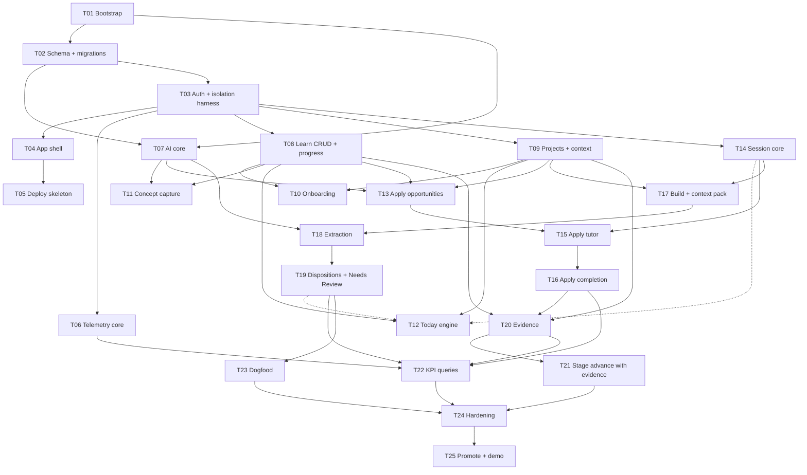

# AppliedLoop v0 — Master Implementation Plan

> **For agentic workers:** this file is the roadmap. Step-by-step TDD plans (checkboxes, exact commands, complete code) are written per slice in `docs/superpowers/plans/`. Execute those with `superpowers:subagent-driven-development` or `superpowers:executing-plans`, not this file.

**Goal:** ship the experimental v0 of AppliedLoop: the loop Learn → Apply → Build → Extract → Evidence working end to end for one real student on one real project.

**Architecture:** one Next.js (App Router) app with a REST surface at `/api/v1`. Pages and handlers call framework-free `domain/*` services that take an `AuthContext` and own every database query. `lib/ai` is the only door to a model. Apply and Build are separate modules, selected by the persisted `session.type`.

**Tech stack:** Next.js, TypeScript (strict), PostgreSQL (PGlite locally, Neon deployed), Drizzle, Zod, Tailwind + shadcn/ui, Vitest, Playwright, pnpm. AI through the AI SDK with the model chosen per task from the environment. ADR-0001 to ADR-0004, **Accepted 2026-10-05**.

---

> **Status:** draft for owner approval, Day 0, 2026-10-05.
> **Inputs:** [SPEC](SPEC.md) · [DATA_MODEL](DATA_MODEL.md) · [API](API.md) · [ACCEPTANCE_TESTS](ACCEPTANCE_TESTS.md) · [SPEC_REVIEW](SPEC_REVIEW.md) · [ADRs](decisions/).
> This plan changes no product behavior. Where a task relies on a **proposed** amendment it says so (`R-xx`). It contains no code on purpose: exact code needs the stack and the amendments to be final.

## 1. Architecture summary

```text
 browser
    │
 app/   pages · server components · route handlers      thin: resolve ctx → validate → call → shape
    │   AuthContext (from lib/auth)
    ▼
 domain/*   use-cases; the only code that touches the database
    │              │                  │
    ▼              ▼                  ▼
 lib/db        lib/ai + prompts/*   lib/telemetry
 (Drizzle)     (runAi, registry)    (event_log)
```

1. **Ownership is structural.** Every `domain/*` function is `(ctx, input) => result`. No `ctx`, no query. Queries go through a `scoped(ctx)` helper that injects `user_id` on user-owned tables; join tables are reached only through an already-checked parent. A resource owned by someone else is `NOT_FOUND`, identical to a missing one.
2. **Handlers are thin.** `requireAuth()` → Zod-parse → one domain call → `{data}` or `{error}`. Server components call the same domain functions directly. The app never calls its own HTTP API from the server.
3. **Apply and Build never share a code path.** `domain/sessions/dispatch.ts` maps the *persisted* `session.type` to `apply/` or `build/`. The messages endpoint rejects non-APPLY sessions with 409. Prompt files are separate and never imported across (`prompts/apply/*` vs `prompts/build/*`).
4. **AI is one door.** `runAi({ ctx, purpose, promptVersion, input, schema })` builds the prompt from a versioned registry, calls the provider, Zod-validates, writes `ai_runs`, and returns a typed result or a typed failure. Callers degrade: capture falls back to manual entry, a tutor timeout leaves the session resumable.
5. **State changes are guarded.** Session transitions follow the R-08 state machine. Unique constraints (`extractions.build_session_id`) plus status checks make completion and extraction idempotent. Multi-record changes (disposition → concept + debt, completion → progress event) run in one transaction.
6. **Telemetry is emitted by domain code**, not by UI paths, so it can't be skipped. A failed event write is logged and never fails the user's action.
7. **Tests mirror the risk.** Unit (pure rules: Today ordering, stage transitions, name normalization, leakage heuristic, context-pack builder) · integration (domain services on a real Postgres engine, including the cross-user harness) · E2E (the golden path) · AI evals (fake provider by default, real models on demand).

## 2. P0 feature → implementation map

| P0 feature | Pages / components | API | Domain service | Tables | Tests |
|---|---|---|---|---|---|
| Authentication + onboarding | `/sign-in`, `/onboarding` | `GET /me`, `PATCH /me/profile` | `lib/auth`, `learning/sources`, `projects` | `users`, `user_profiles` | AT-01, AT-02 |
| Learning sources | `/learn` source list + form | `/learning-sources` CRUD | `learning/sources` | `learning_sources` | AT-01 |
| Fast concept capture | `/learn` capture box, candidate review | `POST /concepts/capture`, `POST /concepts`, `POST /concepts/bulk` (R-13) | `learning/capture`, `learning/concepts` | `concepts`, `concept_skills`, `concept_progress`, `ai_runs` | AT-03 |
| Skill/concept mapping | skill picker, concept detail | `/skills`, `PATCH /concepts/:id`, `PATCH /concepts/:id/progress` | `learning/skills`, `learning/progress` | `skills`, `concept_skills`, `concept_progress`, `progress_events` | AT-04, AT-17 |
| Project management-lite | `/projects`, `/projects/[id]` tabs | `/projects` CRUD, `/projects/:id/skills`, `PUT /projects/:id/context` | `projects/projects`, `projects/context` | `projects`, `project_skills`, `project_context_snapshots` | AT-05 |
| Today | `/today` cards + Needs Review strip | `GET /today` | `today/select-actions` | reads `sessions`, `learning_debt_items`, `concepts`, `concept_progress`, `projects` | AT-06 |
| Apply opportunity generation | opportunity picker | `POST /apply/opportunities` | `sessions/apply/opportunities` | `practice_opportunities`, `ai_runs` | AT-07 |
| Apply tutoring session | `/sessions/[id]` ApplyView | `POST /sessions`, `GET /sessions/:id`, `…/messages`, `…/complete`, `…/hints`, `…/switch-to-build` | `sessions/apply/*`, `sessions/sessions` | `sessions`, `session_messages`, `progress_events` | AT-08 to AT-10, AT-20, AT-21 |
| Build session | `/sessions/[id]` BuildView | `POST /sessions`, `POST /sessions/:id/context-pack` (R-15), `…/complete` | `sessions/build/*` | `sessions`, `project_context_snapshots` | AT-11, AT-12 |
| Extraction | `/sessions/[id]/extract` | `POST /extractions`, `PATCH /extractions/:id/items/:itemId` | `extraction/*` | `extractions`, `extraction_items`, `ai_runs` | AT-13, AT-14, AT-21 |
| Learning debt / Needs Review | Today strip, Project list | `GET/PATCH /learning-debt` | `learning/debt`, `extraction/dispositions` | `learning_debt_items`, `concepts` | AT-15 |
| Evidence | `/evidence`, `/evidence/[id]` | `/evidence` CRUD | `evidence/*` | `evidence_items`, `evidence_concepts`, `evidence_skills` | AT-16, AT-17 |
| AI prompt/version tracking | none (rows only) | none | `lib/ai/run`, `lib/ai/registry` | `ai_runs` | AT-20, registry unit tests |
| Core telemetry | none | `POST /events` (client UI events only) | `lib/telemetry/emit` | `event_log` | AT-23 |

## 3. Proposed file tree

```text
appliedloop/
├─ CLAUDE.md
├─ docs/                              (this folder)
├─ drizzle/                           SQL migrations, checked in
├─ scripts/
│  ├─ seed.ts                         skills + optional demo data
│  └─ kpi/                            *.sql: activation, first-transfer, north star …
├─ src/
│  ├─ app/
│  │  ├─ (auth)/sign-in/
│  │  ├─ (authenticated)/
│  │  │  ├─ layout.tsx                shell: Today · Learn · Projects · Evidence
│  │  │  ├─ onboarding/  today/  learn/
│  │  │  ├─ projects/[id]/            Overview · Learning · Evidence · Sessions
│  │  │  ├─ sessions/[id]/            mode-aware: ApplyView | BuildView
│  │  │  │  └─ extract/               ExtractionReview
│  │  │  └─ evidence/  evidence/[id]/
│  │  └─ api/v1/…                     route handlers, one folder per resource (API.md)
│  ├─ domain/
│  │  ├─ learning/                    sources · skills · concepts · capture · progress · debt
│  │  ├─ projects/                    projects · context
│  │  ├─ today/                       select-actions · config
│  │  ├─ sessions/
│  │  │  ├─ sessions.ts               state machine ACTIVE → COMPLETED | ABANDONED | SWITCHED
│  │  │  ├─ dispatch.ts               session.type → apply | build
│  │  │  ├─ apply/                    opportunities · tutor · hints · leakage · complete
│  │  │  └─ build/                    context-pack · complete
│  │  ├─ extraction/                  extract · items · dispositions
│  │  └─ evidence/
│  ├─ lib/
│  │  ├─ db/                          client (PGlite | Postgres) · schema/ · scoped.ts
│  │  ├─ auth/                        adapter · context.ts
│  │  ├─ ai/                          run.ts · registry.ts · provider.ts · fake.ts · schemas/
│  │  ├─ telemetry/                   emit.ts
│  │  ├─ integrations/                (P1; empty in v0)
│  │  ├─ env.ts                       Zod-validated environment
│  │  └─ copy.ts                      user-facing strings ("Needs Review" …)
│  ├─ prompts/
│  │  ├─ capture/  opportunity/  apply/  extraction/
│  │  └─ build/                       context-pack preamble only (R-07)
│  └─ components/                     ui/ · learning/ · projects/ · sessions/
└─ tests/
   ├─ unit/   integration/ (incl. authorization harness)   e2e/   ai-evals/
```

## 4. Dependency graph



Dotted edges are soft: Today ships its Apply/Build rules first and switches on Resume and Needs Review as those data sources appear. **Critical path:** T01 → T02 → T03 → T14 → T15 → T16 → T20 → T24. After T03, four tasks are independent (T06, T08, T09, T14), and T07 can run alongside T02 and T03.

## 5. Vertical slices

| Slice | Days | Tasks | Exit criterion (what you can demo) |
|---|---|---|---|
| **S0 Walking skeleton** | 1 | T01 to T05 | Sign in → empty Today, **deployed**; cross-user isolation harness green |
| **S1 Your real life in the app** | 2–3 | T06 to T12 | Your IS courses and Adaptive Language exist; you capture a concept; Today proposes the next action from real data |
| **S2 Apply** | 4 | T13 to T16 | A complete real Apply session; the tutor refuses to hand over the solution; stage advance confirmed by you |
| **S3 Build → Extract** | 5–6 | T17 to T19 | A context pack you actually use in Claude Code or Codex; extraction produces Needs Review items |
| **S4 Evidence and measurement** | 7 | T20 to T22 | Evidence created from your Apply session; the KPI funnel query returns rows |
| **S5 Dogfood and harden** | 8–10 | T23 to T25 | Golden-path E2E green; real-model eval report; production promoted, demo seed, README |

Each slice gets its own detailed plan, written when its prerequisites are accepted. **S0's plan is next.** Day 4 is the heaviest; if it slips, the evidence prefill and stage-advance UI in T16 move to Day 7 (Days 8 to 9 are the buffer).

## 6. Ordered task list

| ID | Task | Depends on | Done when |
|---|---|---|---|
| **T01** | **Bootstrap repo.** Next.js + TS strict, pnpm, ESLint/Prettier, Vitest, Playwright, Zod env module, `.env.example`, `.gitattributes`, `git init`; fill CLAUDE.md "Commands" | ADR-0001 (accepted) | `typecheck`, `lint`, `test`, `build` all run green on the bare app |
| **T02** | **Schema and migrations.** Drizzle schema for the v0 tables with approved amendments (R-01 to R-06, R-12, R-14, R-19, R-24); PGlite client plus server-Postgres factory; `skills` seed | T01, approvals | Migrations apply from empty; constraint tests pass (FKs, uniques, `hint_level` check, one extraction per build session) |
| **T03** | **Auth boundary.** Adapter per ADR-0002, `getAuthContext`/`requireAuth`, `users` mapping, `scoped(ctx)`, **cross-user isolation harness** (table-driven; later tasks register into it) | T02 | Sign-in works locally; harness proves user B cannot read or modify user A's rows for every entity so far (AT-01) |
| **T04** | **App shell.** Authenticated layout (Today · Learn · Projects · Evidence), sign-in page, empty states, calm light/dark tokens, `lib/copy.ts` | T03, D-7 | Sign in → empty Today; nav is keyboard-operable |
| **T05** | **Deploy the skeleton.** Vercel project, Neon database, env separation, migrations on deploy, health check | T04, owner accounts | Deployed URL signs you in and shows the empty Today; migrations ran on Neon |
| **T06** | **Telemetry core.** `event_log`, `emit()`, `POST /events` (client UI events only), structured logger with request IDs | T03 | A domain call writes an event; a failing event write never fails the action |
| **T07** | **AI core.** Provider factory (Gateway / direct / Fake), versioned prompt registry, `runAi`, `ai_runs`, per-user rate limit, typed failures, env-driven model config | T01, T02; owner API key for the live smoke test | Fake-provider tests cover success, invalid output, timeout, rate limit; one opt-in live call works |
| **T08** | **Learn CRUD and progress.** Sources (archive semantics, R-16), skills (seed + custom), concepts (`normalized_name`, R-14), `concept_progress`, `progress_events`, pure `canTransition` (R-18), `PATCH …/progress`; Learn page | T03, D-2 | AT-04; harness extended; Learn lists concepts by source with stage |
| **T09** | **Projects and context.** Projects CRUD with archive, `project_skills`, versioned context snapshots (R-03), `ai_enabled` (R-12); project page shells | T03 | AT-05; archived projects leave the active list; snapshot versions increment |
| **T10** | **Onboarding.** First source + first project; "I already have a project / I'm starting one" (R-22) | T08, T09, D-6 | AT-02 E2E; missing optional data never blocks |
| **T11** | **Concept capture.** `POST /concepts/capture` through `runAi`, candidate review ("Confirm all", edit), `POST /concepts/bulk`, dedupe on `normalized_name`, manual fallback when AI is unavailable | T07, T08 | AT-03 plus capture fixtures green; AI-unavailable path tested |
| **T12** | **Today engine.** `selectTodayActions` (R-09), `GET /today`, Today UI. **Learning checkpoint 1** | T08, T09 (soft: T14, T19), D-3 | AT-06: ordering, one-per-type cap, ties, archived exclusion; Today shows a real next action from your data |
| **T13** | **Apply opportunities.** `POST /apply/opportunities` (prompt `opportunity/v1`, project-context-aware, success criteria), `practice_opportunities` lifecycle, regenerate/dismiss, picker UI | T07, T08, T09 | AT-07 fixtures: authentic, irrelevant concept not forced, criteria present, missing context admitted |
| **T14** | **Session core.** State machine (R-08), `session_messages`, `GET /sessions`, `GET /sessions/:id`, `POST /sessions` (with `opportunityId`), idempotent `complete`, `abandon`, `DELETE`; `dispatch.ts` | T03, T09, D-4 | AT-20, AT-21; illegal transitions return 409; Resume can read ACTIVE sessions |
| **T15** | **Apply tutor.** Prompt `apply/v1`; messages endpoint (APPLY only); server-held `hint_level` and `POST …/hints` (R-05); schema validation and over-level clamp; leakage heuristic + `apply_leakage_suspected`; `switch-to-build` (R-06); Apply UI. **Learning checkpoint 2** | T07, T13, T14 | AT-08, AT-09, AT-10 green on the fake provider; one real-model run recorded |
| **T16** | **Apply completion.** Reflection form, `reflection_json`, suggested stage advance shown for confirmation, optional evidence prefill | T08, T15 | AT-17: declining works, nothing auto-advances; completion and stage events emitted |
| **T17** | **Build session and context pack.** BUILD sessions; `POST /sessions/:id/context-pack` = latest snapshot + milestone + goal + open debt + the agent preamble (R-07); Copy for Codex / Claude Code; notes; Finish & Extract | T09, T14, D-1 | AT-11; AT-12 (pack carries no Apply restrictions); `context_pack_copied` event |
| **T18** | **Extraction.** `POST /extractions` (prompt `extraction/v1`), items all `UNREVIEWED` with null understanding, one per build session, low-confidence output when no artifacts, review UI | T07, T17 | AT-13, AT-14, AT-21; no copy implies ignorance |
| **T19** | **Dispositions and Needs Review.** `PATCH …/items/:itemId` with the R-10 transaction; `GET/PATCH /learning-debt` (status, priority, pinned); lists on Today and Project. **Learning checkpoint 3** | T08, T18 | AT-15: reject creates nothing; accept creates exactly one concept-or-link plus one debt item; undo dismisses |
| **T20** | **Evidence.** CRUD (project required, R-19), concept and skill links, contribution classification, pasted artifact links, filters, detail view; survives artifact-link deletion | T08, T09 (soft: T16), D-5 | AT-16 |
| **T21** | **Stage advance with evidence.** `DEMONSTRATED` needs linked evidence; evidence can suggest an advance; the student confirms | T20 | AT-17 extended; T08's transition rules enforce it |
| **T22** | **KPI queries.** SQL under `scripts/kpi/`: activation funnel, first-transfer, learn→apply conversion, build→extract rate, extraction acceptance, north-star weekly transfers. **Learning checkpoint 4** | T06, T16, T19, T20 | AT-23: the funnel query returns rows for the golden-path run |
| **T23** | **Dogfood.** Use v0 on Adaptive Language for real; log at least 3 workflow problems in `docs/research/dogfood-findings.md`; turn bad AI output into fixtures | T19 (ideally T20) | Findings logged; fixtures added |
| **T24** | **Hardening.** Golden-path E2E; full real-model eval run (report the leakage rate); security pass using prompt #5; accessibility pass on the core flows | T21, T22, T23 | All V0-tier acceptance criteria green; Critical and High findings fixed |
| **T25** | **Promote and demo.** Production promotion, demo seed, README, backup/restore check against RPO/RTO | T24 | Shareable URL; README lets another student run it |

## 7. Learning checkpoints — where you write the code

Your CLAUDE.md says understanding must not fall behind what was built, so these are the five spots where I prepare the types, the tests and the surrounding code, and you write the 5 to 10 lines that carry the product decision. Each has more than one defensible answer.

| # | File | You write | The decision behind it |
|---|---|---|---|
| 1 | `src/domain/today/select-actions.ts` | the ordering and selection rule | Strict precedence or a score? Oldest or newest first on ties? What counts as "recent"? Does an ACTIVE session suppress new suggestions? This decides how the product feels every morning. |
| 2 | `src/domain/sessions/apply/leakage.ts` | `looksLikeSolutionLeak(reply, hintLevel, signals)` | A false positive annoys; a false negative defeats the product. Code-fence line limits per hint level, plus signature tokens from the fixture. |
| 3 | `src/domain/extraction/dispositions.ts` | `effectsOf(disposition, understanding)` | Which combinations create a concept and a debt item, which only get recorded. Does "already know + can recreate" ever touch the stage? (Spec says no.) |
| 4 | `scripts/kpi/north_star_weekly_transfers.sql` | the query, as a CTE | You are learning CTEs in IS 402 right now, and this is a real one. I supply the schema, seed rows and the expected result. |
| 5 | `src/domain/learning/progress.ts` | `canTransition(from, to, evidenceCount)` | The D-2 rules: any stage allowed, `DEMONSTRATED` needs evidence, `COMFORTABLE` is self-attested. |

## 8. Cut list (in this order, if the schedule slips)

1. AI-assisted capture becomes manual capture only (T11 shrinks to the form).
2. Evidence filters and search (T20).
3. KPI SQL beyond the activation funnel and the north star (T22).
4. Project "Sessions" tab; Learn search.
5. Tutor streaming (v0 uses a pending state).
6. Onboarding polish.

**Never cut:** the Apply guardrail fixtures, the authorization harness, "extraction never claims ignorance", idempotent completion and extraction.

## 9. Risks

| # | Risk | Impact | Mitigation |
|---|---|---|---|
| 1 | Ten days is tight for a student carrying coursework; Day 4 is the heaviest | Schedule | Slice order, the cut list, Days 8 to 9 as buffer, no P1 work in v0 |
| 2 | The Apply tutor leaks full solutions, which breaks the keystone invariant | Product-defining | Server-held hint ladder, leakage heuristic, fixtures before UI polish, explicit mode switch, track the leakage rate |
| 3 | Extraction is weak without diffs, since v0 takes a manual summary | Product value | The context-pack preamble asks the agent for a structured "concepts introduced" summary; accept pasted SHAs and paths; low-confidence output instead of guessing; GitHub in P1 |
| 4 | Manual capture friction hurts retention (invariant 7) | Adoption | One-field capture, "Confirm all", minimal onboarding, measure manual-entry burden from day one |
| 5 | Cross-user data exposure (IDOR) | Security | ctx-first domain functions, `scoped(ctx)`, a harness every new entity registers into, a T24 sweep |
| 6 | Prompt injection through pasted code or project text | Security | Untrusted-data framing, the tutor has no tools or side effects, schema-validated output, injection fixtures |
| 7 | AI cost and latency | Cost / UX | Per-user rate limit, spend alerts, a cheaper model for Capture, pending states, FakeProvider in tests |
| 8 | PGlite and server Postgres behave differently | Correctness | Deploy on Day 1; run migrations and the integration suite on both before the pilot |
| 9 | The repo lives inside OneDrive | Dev experience, data safety | **Mitigated:** moved to `C:\dev\appliedloop` on 2026-10-05 (ADR-0001) |
| 10 | Docs and code drift apart | Process | CLAUDE.md source-of-truth rule, doc updates in the same change, the SPEC_REVIEW resolution log |
| 11 | Windows quirks: no Docker, long paths, CRLF | Dev experience | PGlite, a short repo path, `.gitattributes` |
| 12 | Single-user dogfooding bias | Validation | Log at least 3 problems, keep interviews running, convert findings to fixtures |
| 13 | Streaming plus structured output is fiddly | Schedule | v0 tutor is non-streaming with a pending state; streaming is polish |

## 10. Decisions that need an ADR

| Decision | Status | Needed before |
|---|---|---|
| ADR-0001 Stack, ORM, UI and test tooling, repo location | Accepted 2026-10-05 | T01 |
| ADR-0002 Authentication | Accepted 2026-10-05 | T03 |
| ADR-0003 AI provider and model configuration | Accepted 2026-10-05 | T07 |
| ADR-0004 Hosting, database, local development | Accepted 2026-10-05 | T02, T05 |
| ADR-0005 Session model: state machine, mode switch, hint ladder (R-05, R-06, R-08) | To write on approval | T14 |
| ADR-0006 Today ranking rules (R-09, D-3) | To write after checkpoint 1 | T12 |
| ADR-0007 Stage transition rules (R-18, D-2) | To write on decision | T08 |
| ADR-0008 Retention and AI-disabled projects (R-12, D-4) | To write on decision | T14 |
| ADR-0009 In-app Build assistant: in or out of v0 (R-07, D-1) | To write on decision | T17 |
| ADR-0010 Authorization pattern: ctx-first domain + `scoped(ctx)` + isolation harness | To write at T03 | T03 |

## 11. Next step

1. ADR-0001 to ADR-0004 are settled. You approve or amend the SPEC_REVIEW items (R-01 to R-06, R-08, R-10 to R-17, R-20, R-23, R-24 can be batch-approved; D-1 to D-7 need your call).
2. I fold the approved amendments into the spec documents and log them in SPEC_REVIEW.
3. I write `docs/superpowers/plans/2026-10-05-slice-0-walking-skeleton.md` (T01 to T05: TDD steps, exact commands, complete code, no placeholders), then you choose how to execute it.

**Owner actions that gate later tasks** (none block Day 1): register the Google and GitHub OAuth apps for T03's live sign-in; create the Vercel project and Neon database for T05; create an AI Gateway key for T07's live smoke test.
